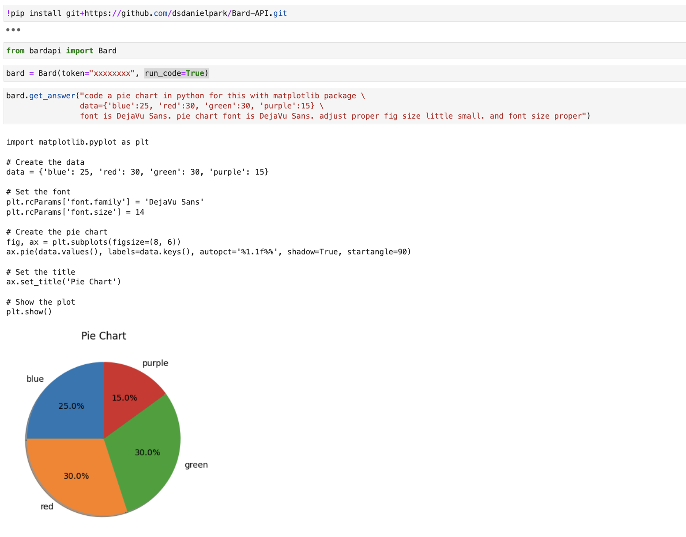
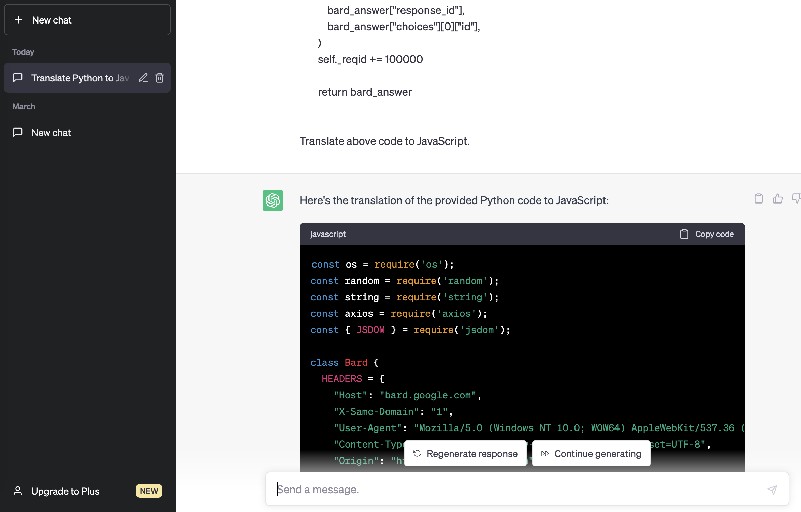

Development Status :: 5 - Production/Stable


# GitHub installation required for the following features.
To remove the dependencies of the bardapi package, you need to install the GitHub developer version.
```
pip install git+https://github.com/dsdanielpark/Bard-API.git
```

<br>

### Multi-language Bard API
GitHub Dev version only.
```python
from bardapi import Bard

bard = Bard(token='xxxxxxxx', language='chinese (simplified)')
res = bard.get_answer("你好。")
print(res['content'])
```
or
```python
from bardapi import Bard
import os
os.environ["_BARD_API_LANG"] = 'chinese (simplified)'
os.environ["_BARD_API_KEY"] = 'xxxxxxxx'

res = Bard().get_answer("你好。")
print(res['content'])
```

<br>

### Get image links
GitHub Dev version only.
```python
from bardapi import Bard
bard = Bard(token='xxxxxxxxxxx')
res = bard.get_answer("Find me an image of the main entrance of Stanford University.")
res['links'] # Get image links (list)
res['images'] # Get images (set)
```
<a href="https://bard.google.com/">

<br>
    
### ChatBard
```python
from bardapi import ChatBard
    
chat = ChatBard()
chat.start()
```
or
```python
from bardapi import ChatBard
import os
os.environ["_BARD_API_KEY"] = 'xxxxxx'   # Requird
os.environ["_BARD_API_LANG"] = Arabic    # Optional, Default to English
os.environ["_BARD_API_TIMEOUT"] = 30     # Optional, Session Timeout
 
chat = ChatBard()
chat.start()
```
or
```python
from bardapi import Bard, SESSION_HEADERS
import os
import requests

token='xxxxxxxxxxx'
session = requests.Session()
session.headers = SESSION_HEADERS
session.cookies.set("__Secure-1PSID", token) 
proxies = {
    'http': 'http://proxy.example.com:8080',
    'https': 'https://proxy.example.com:8080'
}
    
ChatBard(token=token, session=session, proxies=proxies, timeout=40, language="chinese (simplified)").start()
```

<br>    

### Executing Python code received as a response from Bard
GitHub Dev version only.
```python
from bardapi import Bard
    
bard = Bard(token="xxxxxxxx", run_code=True)
bard.get_answer("code a pie chart in python for this data={'blue':25, 'red':30, 'green':30, 'purple':15}")
```

    
<br>

### Using Bard asynchronously 
GitHub Dev version only.    
    
Using asynchronous implementation will be efficient when implementing ChatBots or something alone those lines.    
BardAsync is not using requests library instead it is using httpx library and http2 protocol.
    
BardAsync is present in translate_to.core_async.BardAsync
```python
from bardapi import BardAsync 
    
bard = BardAsync(token="xxxxxxxx")
await bard.get_answer("What is Metaverse?")
```
or
```python
import asyncio
from bardapi import BardAsync
    
bard = BardAsync(token="xxxxxxxx")
asyncio.run(bard.get_answer("What is Metaverse?"))
```

<br>
    

## Bard Which Can get Cookies
GitHub Dev version only.    

```python
from bardapi import BardCookies

cookies = {
    '__Secure-1PSID': 'xxxxxxxxxxx',
    'APISID' : 'xxxxxxxxxxx',
    'SAPISID' : 'xxxxxxxxx'
}

bard = BardCookies(cookies=cookies)
resp = bard.get_answer("hi")

resp['content']
```

<br>


## Translation to Another Programming Language
Please check the translation results in [this folder](https://github.com/dsdanielpark/Bard-API/tree/main/translate_to).
- Copy the code of [Core.py](https://github.com/dsdanielpark/Bard-API/blob/17d5e948d4afc535317de3964232ab82fe223521/bardapi/core.py).
- Ask ChatGPT to translate like "Translate to Swift."
- Ask ChatGPT to optimize the code or provide any desired instructions until you're satisfied.<br>


            
            
